# Arto Signature — interface 0.6.1

An operator should see the client, the next useful phrase and the state of the call without searching through a settings form. This redesign changes the shell and information hierarchy while retaining the native WPF controls and existing call logic.

## Concepts and choice

Two original WPF sketches explored the same fictional client-portal conversation. They are concept renderings, not app screenshots.

| A — Signature Workbench | B — Conversation Focus |
| --- | --- |
| 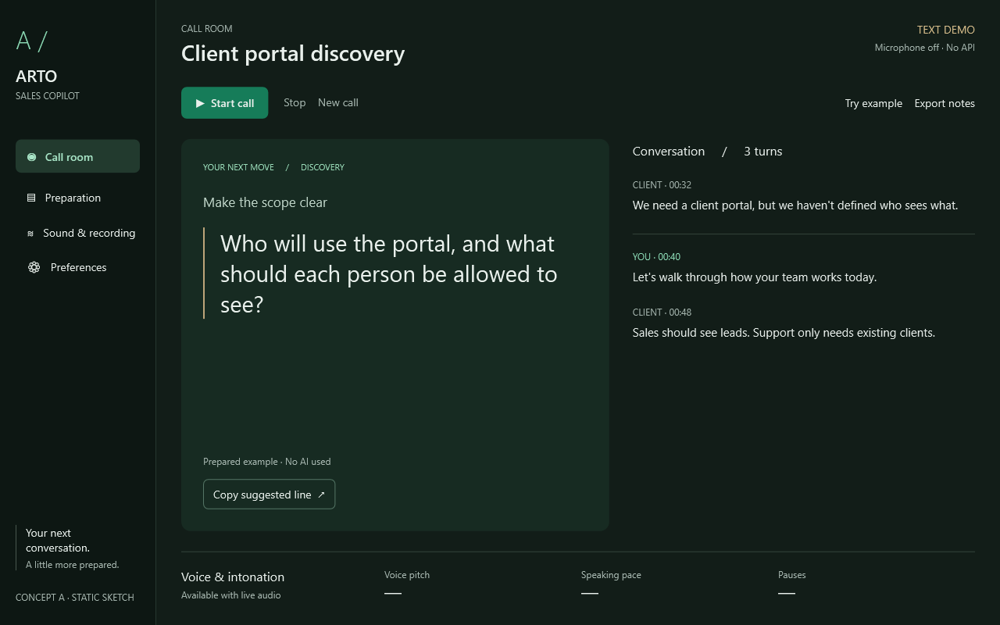 | 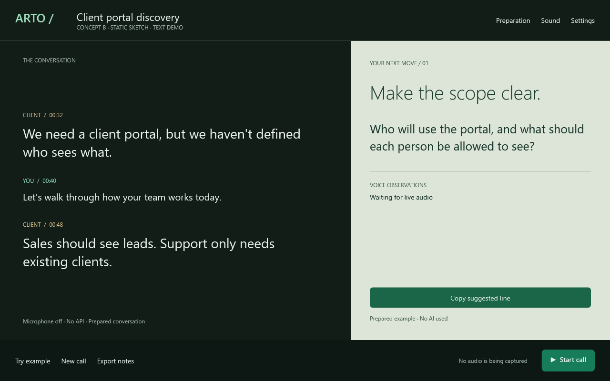 |
| Persistent labeled navigation; the reply leads, transcript supports, voice observations form a separate strip. | Transcript leads; a contrasting right-hand reply panel and bottom controls make a more editorial split. |

**Selected: A.** It puts the next spoken phrase first and makes Preparation, Audio and Settings findable during a call. B's larger typography informed the final reply area; its competing transcript emphasis and two dominant surfaces were rejected. `docs/redesign/render-concepts.ps1` reproduces both sketches in WPF (run with PowerShell 7, or read it as UTF-8 when using Windows PowerShell 5).

## Sources and implementation route

Visual inspection included Linear's enlarged After screenshot, the WPF UI gallery window, and the Transitions menu example in the browser. Sources were reviewed on 2026-09-26.

- [Linear's redesign](https://linear.app/now/how-we-redesigned-the-linear-ui): persistent side navigation, consistent alignment between navigation and workspace, and fewer competing containers. The transcript now reads as a quiet feed instead of another equally loud card.
- [Microsoft materials](https://learn.microsoft.com/en-us/windows/apps/design/signature-experiences/materials) and [WPF .NET 10](https://learn.microsoft.com/en-us/dotnet/desktop/wpf/whats-new/net100): native controls, clear surface hierarchy and platform-aware chrome. Reading surfaces and popups remain opaque. On Windows 11 build 22621+, the native caption requests Mica only when transparency is enabled and high contrast is off. Unsupported systems or disabled transparency get an opaque fallback. No Acrylic blur is added behind long device names.
- [Emil's animation guidance](https://emilkowal.ski/ui/you-dont-need-animations) and [Transitions](https://transitions.dev/): small, interruptible feedback rather than ambient animation. Menu and detail reveals are 140–160 ms; new advice is 180 ms. Keyboard-triggered reveals are immediate.

### Native templates versus WPF UI

| Path | Compatibility and cost | Decision |
| --- | --- | --- |
| A. Built-in WPF/Fluent with own templates | WPF .NET 10 already supplies native focus, selection and automation peers. The [Fluent resource-dictionary route](https://learn.microsoft.com/en-us/dotnet/desktop/wpf/whats-new/net90#apply-the-theme) was prototyped. Its implicit styles interfered with the existing nested control templates, so the final app uses explicit authored templates without a global Fluent theme dictionary. | Selected native-control route with a complete custom visual layer and no extra theme manager. |
| B. [WPF UI](https://wpfui.lepo.co/) | [Current source](https://github.com/lepoco/wpfui/blob/main/src/Wpf.Ui/Wpf.Ui.csproj) targets .NET 10 and other Windows frameworks. [MIT licensed](https://github.com/lepoco/wpfui/blob/main/LICENSE). It brings its abstraction project, System.Memory, build-time CsWin32/analyzers and embedded Fluent icons. It offers navigation/dialog controls but would add another theme/navigation integration to this small app. | Evaluated, not installed. No license or binary is being copied from it. |

No React, web view, SaaS framework, web CSS or new NuGet dependency was introduced. `frontend-ui-source-router`, `frontend-design`, `emil-design-eng` and `accessibility` informed the work. `hallmark-ui-web-audit` was inspected for visual critique; its browser/mobile/Lighthouse procedure is not a native WPF acceptance test.

## Visual system

- `UiTheme.Palette` owns semantic colors. Night uses graphite/pine, Day uses porcelain and neutral green-tinted surfaces. Emerald indicates meaningful actions/selection; a restrained metal rule marks the suggested phrase.
- Segoe UI Variable Text / Display with Segoe UI fallback gives Latin/Cyrillic coverage without bundling fonts. Type scale: 10–12 metadata, 13–14 controls, 16–18 section titles, 20 compact reply, 27 full reply/title.
- Navigation rail: 184 device-independent pixels; content gutter: 28; grouping gaps: 12/18/24/28. Controls use 6-pixel corners; the reply and grouped surfaces use 12. Native caption controls remain native.
- Four distinct surfaces: rail, workspace, selected/control surface, elevated grouping. The call view uses one prominent reply panel, an unboxed transcript and a ruled voice strip. Audio uses an open device section and a recording surface rather than two identical forms.
- High-contrast Windows settings select system colors. Text pairs are tested at 4.5:1; control borders/focus indicators at 3:1. This is targeted verification, not a claim of full WCAG or screen-reader certification.
- Selected navigation has a filled background plus text weight. Keyboard focus has a separate outline. Press feedback is immediate and does not change measured layout. Fields and menus have their own focus/selection states.

## Interaction and truthfulness

`UiMotion` animates only opacity and a four-pixel translation with ease-out. Snapshot-and-replace prevents queues. It respects `SystemParameters.ClientAreaAnimation`, high contrast and keyboard input. Windows preference changes refresh chrome/colors. Save/copy feedback appears briefly without changing focus. Advice updates retain focus and fixed panel geometry; longer replies scroll inside the advice area.

The inset phrase rule marks the suggested reply. The rail uses the plain Arto / Sales Copilot wordmark; the ambiguous A-slash decoration was removed in 0.6.1. There are no running decorative waveforms, fake levels or invented sales probabilities. Demo voice values remain em dashes; scripted advice has no confidence number in its tooltip. Audio meters still use the existing real capture values.

The two call disclosures now have outlined 44-pixel headers, explicit localized Open/Hide actions, a rotating chevron and hover/focus feedback. Empty topics explain when content will appear. Capture status occupies its own automatic-height grid row with complete internal padding and an outer bottom gap. It no longer relies on a hardcoded reserved margin. On short windows, expanded content scrolls the working area instead of squeezing the suggestion away; the capture footer stays visible.

Latest refinement: [collapsed call controls](docs/redesign/after/refined-light-1320-closed.png), [both controls open](docs/redesign/after/refined-light-1320-open.png), [compact expanded area](docs/redesign/after/refined-light-1000-open.png).

Four native tabs retain their existing indices and handlers. Keys, providers, model identifiers, API payloads, audio capture, recording, voice algorithms and storage contracts are unchanged. API key values remain hidden, with saved-state text kept distinct from API availability.

## Visual polish audit

| Before | After | Why |
| --- | --- | --- |
| Navigation, status, actions and meters occupy four horizontal bands. | Labeled rail, contextual header and a compact bottom status strip. | More vertical space for advice; audio state remains available on every page. |
| Reply, transcript and voice compete as similarly framed cards. | Reply is dominant; transcript is open; voice is a separate ruled strip. | Reading order matches the operator's task. |
| Empty-space-heavy settings and native old-style disclosure controls. | More deliberate device/recording grouping, switches, chevrons and rounded fields. | Clearer structure and consistent interaction states. |
| Initial compact prototype clipped an ordinary suggestion. | Reduced compact spacing/type, horizontal reply footer and secondary voice details in the heading tooltip. | The tested ordinary suggestion fits while voice values stay visible. |
| Initial screenshots could catch a transition mid-flight. | Evidence waits for transitions to settle; interaction frames show motion separately. | Static comparisons represent the resting interface. |
| Prototype navigation styling affected content inheritance. | Selected styles target navigation chrome only; existing regression test retained. | Advice text keeps its correct weight/color. |

## Real application evidence

All images below come from the executable's own synthetic UI fixtures. Before images are from 0.5; after images are from 0.6.1. The screenshot exporter now captures the client area exactly, so the old unused bottom strip is absent.

| Screen | Before | After |
| --- | --- | --- |
| Call · Night | 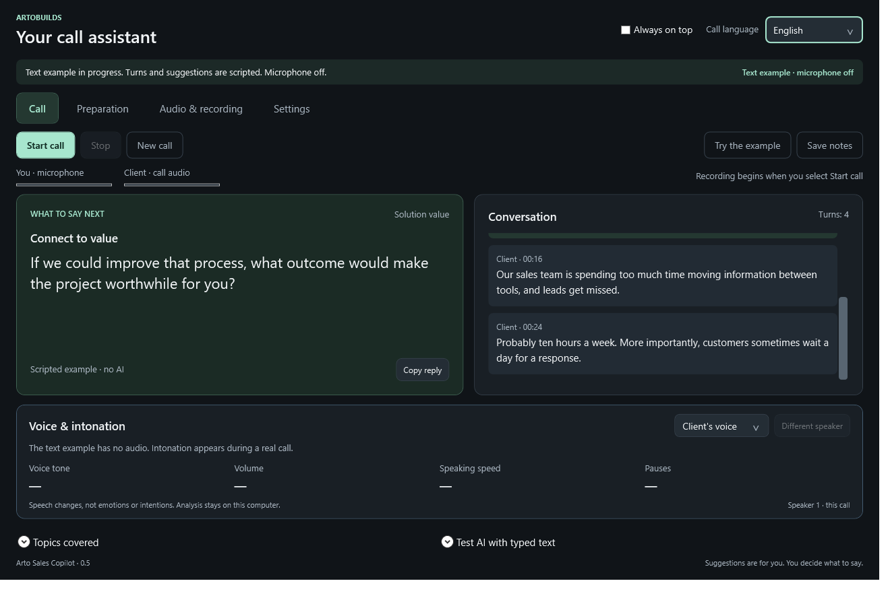 | 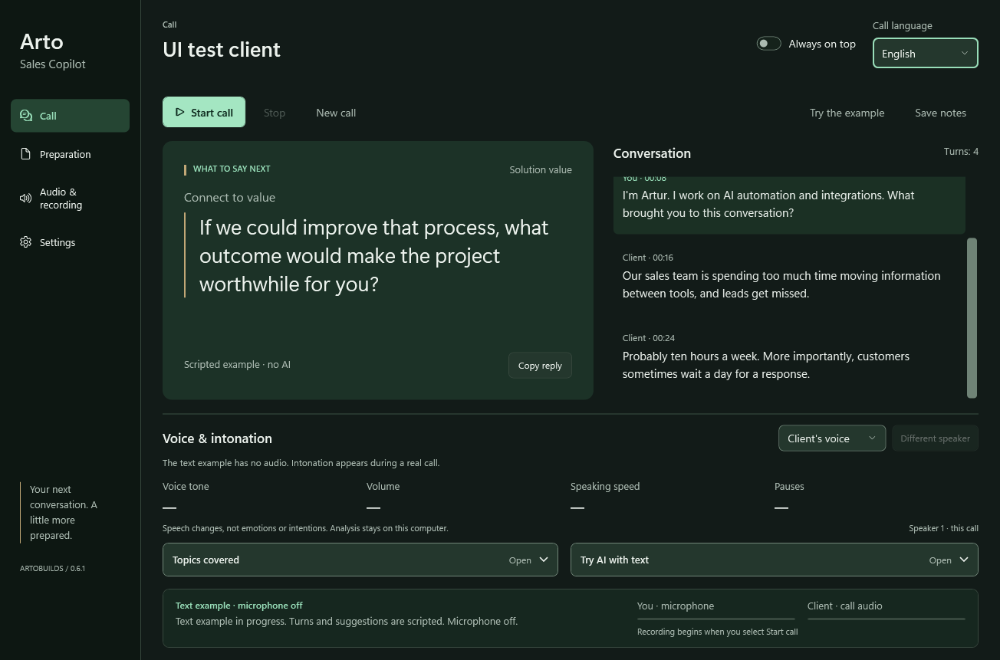 |
| Call · Day | 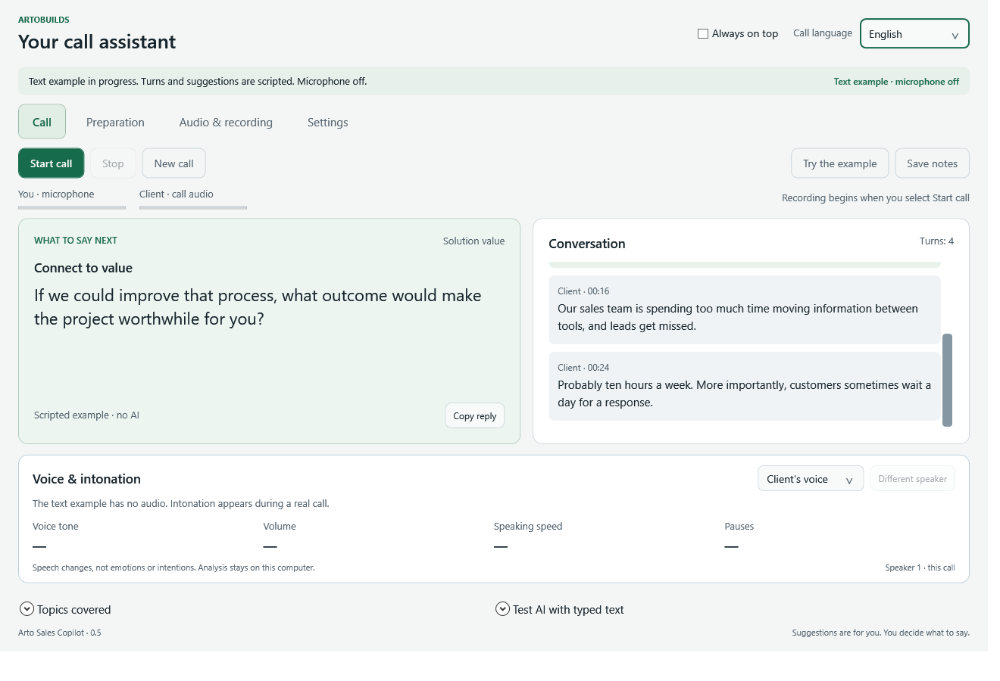 | 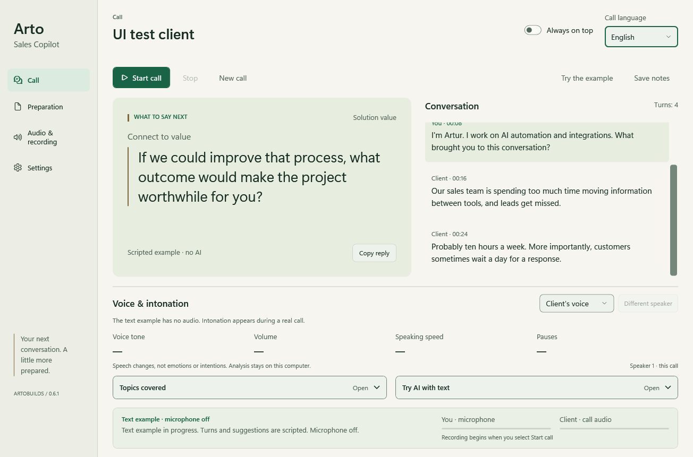 |
| Audio · Night | 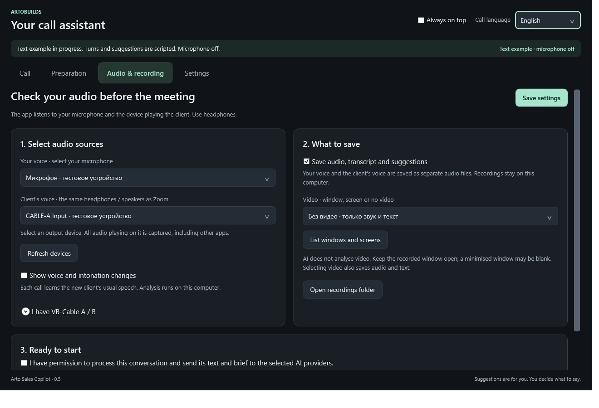 | 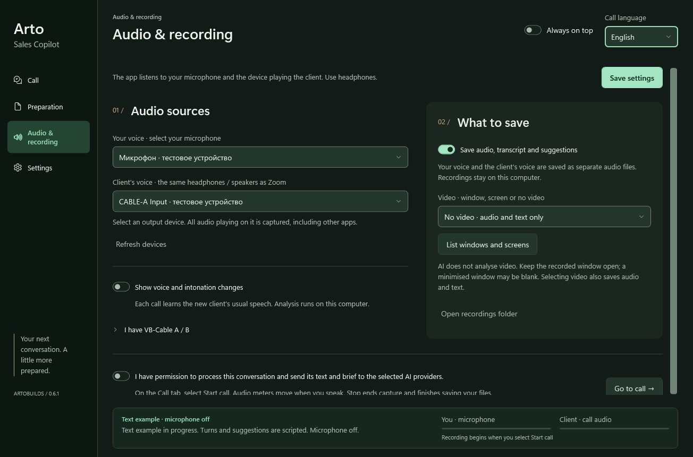 |
| Audio · Day | 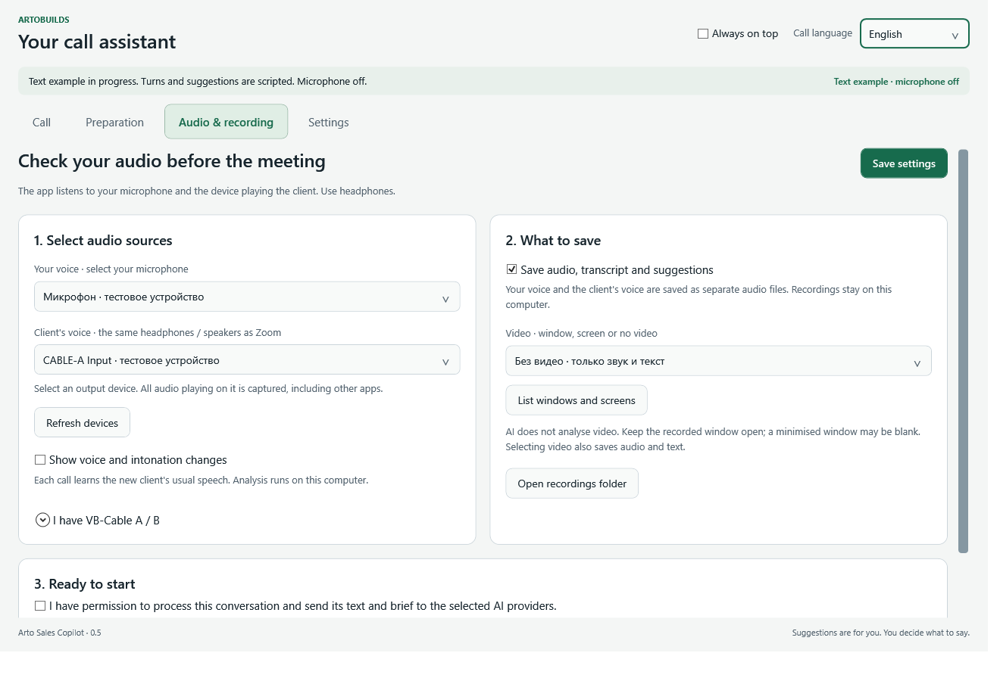 | 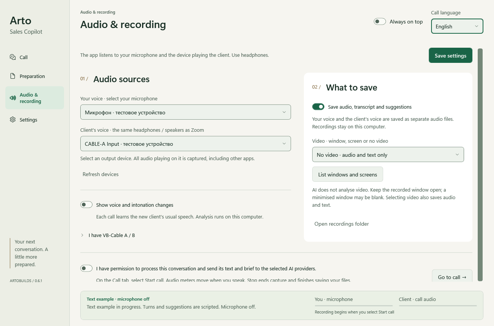 |
| Preparation · Day | 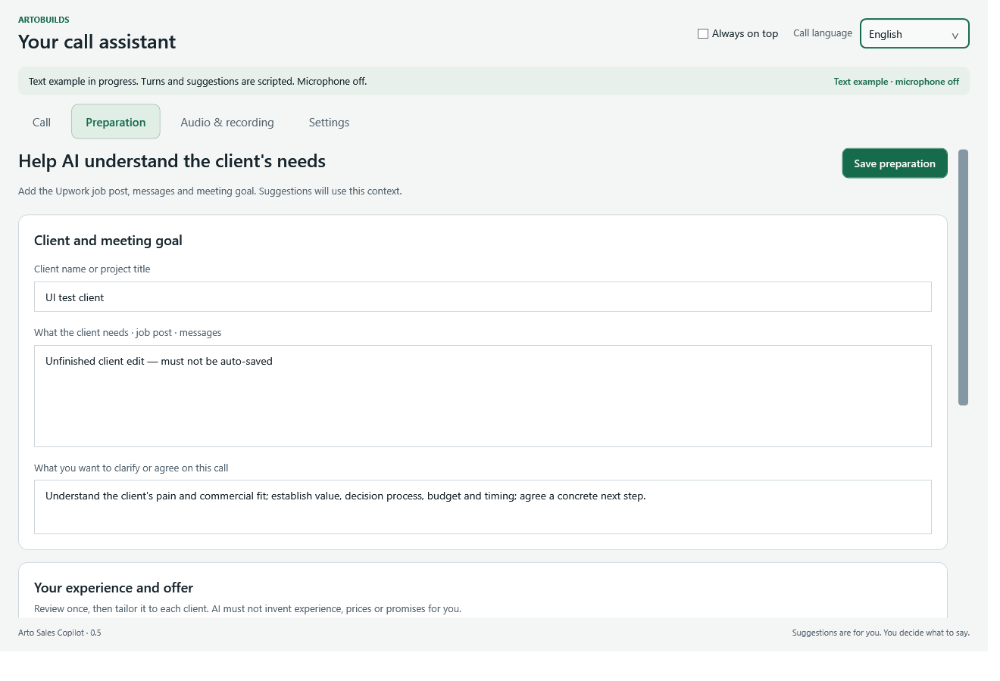 | 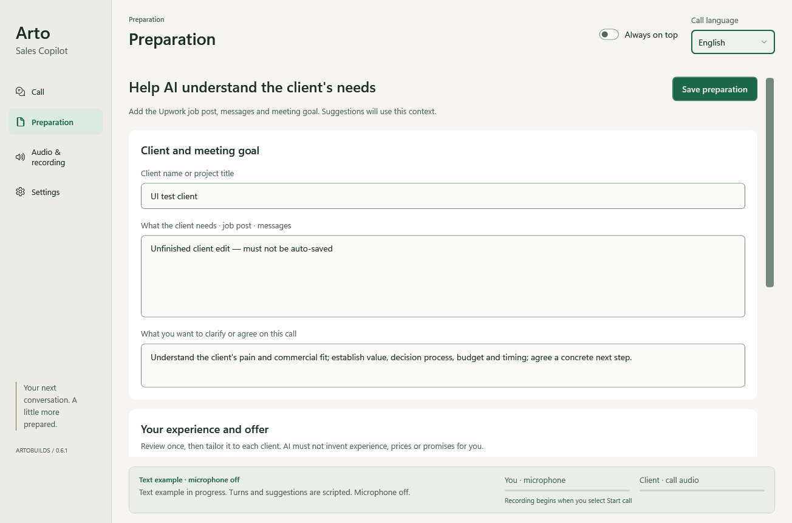 |
| Settings · Day | 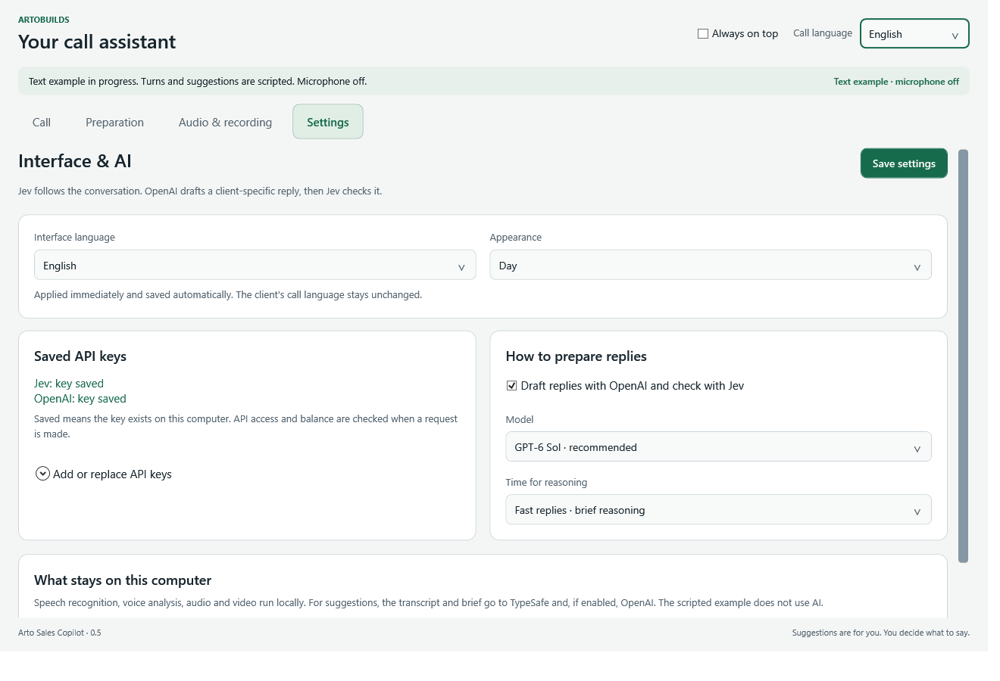 | 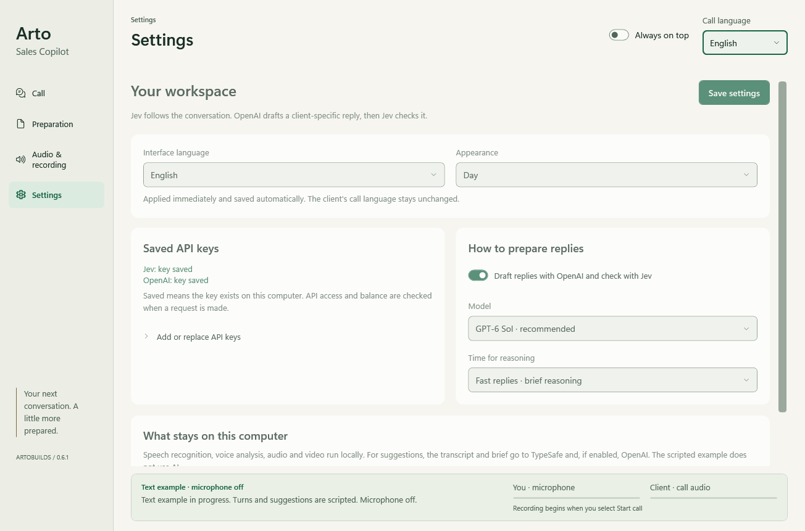 |

[Initial 0.6 interaction demonstration](docs/redesign/arto-signature-interactions.mp4): rendered frames from the real WPF window with fictional content, not a recording of the user's desktop or microphone. This earlier video predates the 0.6.1 wordmark, footer and disclosure refinements shown in the current screenshots. Includes advice update, feedback presentation, audio disclosure, theme and language switching. The feedback segment demonstrates presentation; it does not prove a clipboard write. Native keyboard/dropdown behavior was checked separately.

Detailed test scope and remaining limitations: [VERIFICATION.md](VERIFICATION.md).
