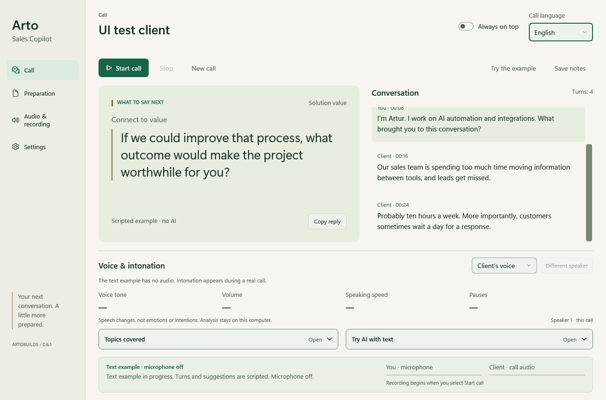

# Arto Sales Copilot

A native Windows assistant that keeps suggested replies, a transcript and local voice observations beside your call.

**Preview 0.6 · Arto Signature · Windows · .NET 10 / WPF · RU / UK / EN · Day / Night themes**



## What it does

- Shows a suggested next phrase and tracks sales/discovery topics using TypeSafe Jev.
- Optionally drafts contextual replies with OpenAI, then checks them with Jev before display.
- Transcribes microphone and computer output separately using local faster-whisper.
- Displays changes in tone, volume, approximate speech speed and pauses against a reference learned for each call.
- Saves optional local audio, transcript, advice and selected-window/display video.
- Offers Russian, Ukrainian and English interface languages independently of the conversation language, plus Day/Night themes.

The offline demo works without API keys, Python, audio capture or a meeting. It uses scripted fictional content, not live AI.

**This is an experimental preview.** Local tests pass, but the complete live Jev + OpenAI + Zoom workflow is not yet accepted. Provider access must be verified with your own account. Voice observations are acoustic measurements, not emotion recognition, lie detection or a probability of winning a sale.

## Build and try the demo

Requirements: Windows 10/11 and the [.NET 10 SDK](https://dotnet.microsoft.com/download/dotnet/10.0). This is a Windows WPF application, not a website or a Java application.

```powershell
git clone https://github.com/artobuilds/arto-sales-copilot.git
Set-Location arto-sales-copilot
.\build.ps1
Start-Process -FilePath '.\app\Arto Sales Copilot.exe'
```

If PowerShell blocks scripts, review the script and use a policy permitted by your organization. The build restores NuGet dependencies and writes to local ignored directories. It does not install Python, download models, create a background service, configure audio routing or start capture.

Select **Посмотреть пример** (View example). The initial interface is Russian; change it in **Настройки → Язык интерфейса**. The Day/Night selector is alongside it. Preferences apply immediately and save automatically.

Version 0.6 introduces persistent side navigation, a client-context header, a focused reply area and a quieter transcript. The voice strip stays visible at 1000×720; in the compact layout, its explanation and speaker-reference detail move to the voice heading's tooltip. Settings retain the same behavior and storage. See the [design decisions, concepts and before/after evidence](DESIGN.md).

Optional: `./build.ps1 -Shortcut` creates a desktop shortcut only if that shortcut does not already exist. Use a writable project directory. Do not distribute your populated `app/` directory.

## Enable live speech

Live speech requires your own Python environment, a downloaded model and sufficient compatible NVIDIA GPU memory. The current worker explicitly uses `large-v3`, CUDA and `int8_float16`; there is no automatic CPU fallback. Follow the [faster-whisper GPU requirements](https://github.com/SYSTRAN/faster-whisper#gpu), including compatible CUDA/cuDNN libraries. This repository does not bundle those libraries or model weights.

Example preparation from the repository directory, using an installed compatible Python:

```powershell
python -m venv .venv
.\.venv\Scripts\python.exe -m pip install -r requirements.txt
.\.venv\Scripts\python.exe -c "from faster_whisper.utils import download_model; download_model('large-v3', cache_dir='.models')"
```

The final command explicitly downloads model files and can use substantial disk space and network traffic. The application itself uses local-files-only mode and never downloads a missing model during a call. A complete fresh CUDA setup has not been validated by this preview; see [verification](VERIFICATION.md).

In **Settings → Advanced**, set the Python executable and model-cache paths if they differ from the default `.venv` and `.models` next to `app/`. For optional video recording, provide the full path to your own compatible [FFmpeg](https://ffmpeg.org/download.html) Windows build. Audio/text capture does not require FFmpeg.

## Configure your own accounts and call

1. Fill **Preparation** with your own verified profile, offer, client context and meeting goal. `brief-template.json` is a neutral starting point. No personal portfolio or client briefing is shipped.
2. In **Settings**, expand the API-key controls and paste your own TypeSafe key and, optionally, OpenAI key. Save. Empty replacement fields retain saved keys; values are never redisplayed.
3. Optional file import uses a file you explicitly choose. TypeSafe files must contain `TYPESAFE_API_KEY=your-key`; OpenAI import expects exactly one key. Do not put key files in the repository.
4. Current configured model identifiers are `jev-latest` and selectable `gpt-6-sol`, `gpt-6-luna` or `gpt-5.6-terra`. Availability depends on provider/account access. The app does not silently substitute models. API calls use your account's credits.
5. In **Sound & recording**, select your microphone and the same headphone/output device as your meeting app. Use headphones. Output loopback captures all apps on that output, not just the meeting.
6. Review recording and provider-processing permissions, then select **Start call**. Nothing listens at startup. Whisper loads before capture starts. **Stop** ends capture and finalizes the saved session; the next Start creates a new session.

Use the assistant alongside Zoom or another call app; it does not join as a meeting bot. If you share or record the whole screen, the assistant may be visible. It does not hide itself from screen sharing.

Jev/API errors stop fresh advice while local transcription/recording can continue. A saved-key label means local storage exists, not that API access or billing works. The advanced Jev demo and typed-text analysis make real API requests; the main offline example does not.

## Voice observations

The voice strip stays visible beneath the suggested reply and transcript. It compares the current channel with its own baseline, initially needing at least three suitable chunks and 12 seconds of clean speech. There can be a delay of roughly one audio chunk (up to about eight seconds) plus processing.

Select **Client voice** or **My voice**. **Different speaker** resets the client's reference when another person speaks on that channel. Each call starts fresh. It cannot automatically distinguish multiple people on one remote track. Microphone gain, noise suppression and mixed voices affect measurements. Detailed method and limits: [VOICE-ANALYSIS.md](VOICE-ANALYSIS.md).

## Data and privacy

Keys are encrypted with Windows DPAPI for the current Windows user in `app/local-data`. Settings and briefs are ordinary local JSON. Saved calls live in `sessions/` with separate WAV tracks, transcript, advice and optional voice observations/video; these recordings are **not encrypted**.

Speech and acoustic analysis stay local. During AI use, brief/transcript text goes to TypeSafe and, when enabled, OpenAI. Audio/video is not uploaded by this application. `store=false` is used for OpenAI Responses; it is not a promise about all provider retention policies. Obtain the permissions needed for your call before capture and external processing. See [PRIVACY.md](PRIVACY.md).

## Development and verification

```powershell
dotnet build -c Release
$test = Start-Process -FilePath '.\app\Arto Sales Copilot.exe' -ArgumentList '--self-test' -Wait -PassThru
$test.ExitCode
$ui = Start-Process -FilePath '.\app\Arto Sales Copilot.exe' -ArgumentList '--ui-smoke' -Wait -PassThru
$ui.ExitCode
```

Re-run `build.ps1` after code changes to update `app/`. Offline and UI checks use fictional inputs and isolated storage without microphone or provider requests. The UI checks need an interactive Windows desktop. `python prosody_tests.py` additionally exercises controlled acoustic measurements with the optional Python dependencies installed.

`--ui-review` opens a fictional review window with a new temporary settings folder and no loaded API keys. This is a UI fixture, not a provider sandbox: do not import real keys or start real capture in it. Set `ARTO_UI_VIDEO=1` while running `--ui-smoke` to render a short sequence of the application's own UI into ignored `test-output/interaction-frames`; it does not capture the desktop or audio.

Do not publish test output, logs, local data, recordings or populated application folders. Review the staged file list even when `.gitignore` excludes them. See [CONTRIBUTING.md](CONTRIBUTING.md) and [VERIFICATION.md](VERIFICATION.md).

## Credits and usage terms

Created under the ArtoBuilds name. The idea was inspired by [moritzkremb/jev-sales-copilot](https://github.com/moritzkremb/jev-sales-copilot). This is a separately authored C#/WPF implementation, not its Python/browser source tree. The upstream code, playbook, recordings and frontend assets are not distributed here.

Third-party dependencies and optional runtimes retain their own licenses: [THIRD-PARTY-NOTICES.md](THIRD-PARTY-NOTICES.md). No credentials, commercial API access, model weights or private client data are included.

The original source in this repository is released under the [MIT License](LICENSE): use, modify and redistribute it, including commercially, while retaining the copyright and license notice. The software is provided without warranty. Third-party components and external services retain their own terms.
